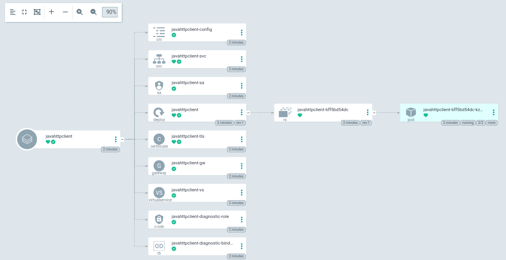

[](https://github.com/wlanboy/JavaHttpClient/actions/workflows/maven.yml)

# JavaHttpClient

A Spring Boot REST service for testing and diagnosing HTTP routes in Kubernetes clusters with Istio service mesh. It acts as a configurable HTTP proxy that forwards requests to any target URL and returns the response along with timing, status and header information. Additionally it exposes Kubernetes and Istio diagnostic endpoints to inspect the service mesh configuration from within the cluster.

## Features

- **HTTP proxy** — forward GET, POST, PUT, DELETE, PATCH, HEAD and OPTIONS requests to any URL, with optional header forwarding and custom headers
- **Kubernetes context** — read namespace, pod name and Istio sidecar status directly from the Kubernetes API
- **Istio diagnostics** — list VirtualServices, DestinationRules, Gateways, ServiceEntries, Sidecars, EnvoyFilters, PeerAuthentications, RequestAuthentications and AuthorizationPolicies
- **Istio full report** — fetch all Envoy configurations and error statistics of the Istio sidecar
- **URL correlation** — check whether a given URL is covered by a VirtualService and which routes/DestinationRules apply
- **TLS inspection** — open a direct TLS connection to a target and return protocol, cipher suite, certificate chain and SPIFFE/mTLS information
- **Web UI** — browser-based frontend to interact with all endpoints
- **OpenAPI/Swagger** — fully documented REST API with SpringDoc

## Tech Stack

| Component | Version |
| --- | --- |
| Java | 25 |
| Spring Boot | 4.0.6 |
| Servlet Container | Jetty (Tomcat excluded) |
| OpenAPI | SpringDoc 3.0.3 |
| Kubernetes Client | client-java 26.0.0 |
| Observability | Micrometer Tracing + Actuator |

## Screenshots

### Web UI


### Istio Tab


### Swagger UI


### Helm Chart



---

## Build

```bash
mvn package
```

### Generate OpenAPI spec (`openapi.json`)

`mvn verify` starts the application as part of the integration test phase, calls `/api-docs`, writes the result to `target/openapi.json` and stops the application again. The file at the project root is the committed result of the last run.

```bash
mvn verify
cp target/openapi.json openapi.json
```

---

## Docker

### Standard image (UBI9 + OpenJDK 25 JRE)

Uses the Red Hat UBI9 base image with the full OpenJDK 25 JRE. Includes Spring Boot AOT processing and CDS (Class Data Sharing) archive for faster startup.

```bash
docker build -f Dockerfile25 -t javahttpclient:jre .
```

### Minimal image (jlink custom JRE + distroless)

Uses `jlink` to create a custom JRE containing only the required modules, then packages it into a `gcr.io/distroless/cc` image. Includes AOT processing and a CDS archive built with the custom JRE.

```bash
docker build -f Dockerfile25Jlink -t javahttpclient:jlink .
```

### Image size comparison

```text
javahttpclient   jre       510MB
javahttpclient   jlink     295MB
```

### Run

```bash
docker run --rm --name httpclient --publish 8080:8080 javahttpclient:jre

docker run --rm --name httpclient --publish 8080:8080 javahttpclient:jlink
```

### Multi-arch build

```bash
bash multiarch-build.sh
```

### Docker Hub

- <https://hub.docker.com/r/wlanboy/javahttpclient>

```bash
docker build -t wlanboy/javahttpclient:latest .
```

---

## API Reference

The full OpenAPI 3.1 specification is available in [openapi.json](./openapi.json).

Interactive Swagger UI: <http://localhost:8080/swagger-ui/index.html>

### `POST /client` — Forward an HTTP request

Forwards an HTTP request with the specified method, URL and optional body to the target system and returns the response.

**Request body** (`application/json`):

| Field | Type | Required | Description |
| --- | --- | --- | --- |
| `url` | string | yes | Target URL — must start with `http://` or `https://` |
| `method` | string | yes | HTTP method: `GET`, `POST`, `PUT`, `DELETE`, `PATCH`, `HEAD`, `OPTIONS` |
| `body` | string | no | Optional request body |
| `contentType` | string | no | Content-Type of the body, e.g. `application/json` |
| `copyHeaders` | boolean | no | Copy incoming request headers to the forwarded request |
| `customHeaders` | object | no | Additional headers to add, as `{"Header-Name": "value"}` |

**Responses:** `200` response from target, `400` validation error, `502` connection error.

#### Examples

Simple GET request:

```bash
curl -X POST http://localhost:8080/client \
  -H 'Content-Type: application/json' \
  -d '{"url": "https://github.com", "method": "GET", "copyHeaders": false}'
```

POST with body and custom content type:

```bash
curl -X POST http://localhost:8080/client \
  -H 'Content-Type: application/json' \
  -d '{
    "url": "https://httpbin.org/post",
    "method": "POST",
    "body": "{\"hello\": \"world\"}",
    "contentType": "application/json",
    "copyHeaders": false
  }'
```

Forward incoming headers and add a custom header:

```bash
curl -X POST http://localhost:8080/client \
  -H 'Content-Type: application/json' \
  -H 'X-Correlation-Id: abc-123' \
  -d '{
    "url": "http://my-service.default.svc.cluster.local/api/v1/data",
    "method": "GET",
    "copyHeaders": true,
    "customHeaders": {"Authorization": "Bearer mytoken"}
  }'
```

DNS resolution via a MirrorService:

```bash
curl -X POST http://localhost:8080/client \
  -H 'Content-Type: application/json' \
  -d '{
    "url": "http://gmk:8003/resolve/google.com",
    "method": "GET",
    "copyHeaders": false
  }'
```

---

### `GET /api/k8s/context` — Kubernetes context

Returns the current namespace, pod name and Istio sidecar status. Used by the web UI navbar on page load.

```bash
curl http://localhost:8080/api/k8s/context
```

---

### `GET /api/k8s/status` — Kubernetes client status

Shows whether the Kubernetes API client was initialized successfully and lists supported Istio resource types and API versions.

```bash
curl http://localhost:8080/api/k8s/status
```

---

### `GET /api/k8s/istio/{type}` — List Istio resources

Lists specific Istio resources in a namespace. The `namespace` query parameter defaults to `default`.

Supported types: `virtualservices`, `destinationrules`, `gateways`, `serviceentries`, `sidecars`, `envoyfilters`, `peerauthentications`, `requestauthentications`, `authorizationpolicies`

```bash
# List all VirtualServices in the default namespace
curl "http://localhost:8080/api/k8s/istio/virtualservices"

# List DestinationRules in a specific namespace
curl "http://localhost:8080/api/k8s/istio/destinationrules?namespace=production"

# List PeerAuthentications (mTLS policies)
curl "http://localhost:8080/api/k8s/istio/peerauthentications?namespace=istio-system"
```

---

### `GET /api/k8s/istio/full-report` — Istio full report

Fetches all Envoy configurations and error statistics of the Istio sidecar. Returns `200` even on error — the body contains the error description in that case.

```bash
curl http://localhost:8080/api/k8s/istio/full-report
```

---

### `GET /api/k8s/correlate` — Correlate URL with Istio routing

Checks whether the given URL is covered by a VirtualService and which routes and DestinationRules apply.

```bash
curl "http://localhost:8080/api/k8s/correlate?url=http://my-service.default.svc.cluster.local/api/v1&namespace=default"
```

---

### `GET /api/k8s/tls` — Inspect TLS certificate

Opens a direct TLS connection to the target URL and returns protocol, cipher suite, the full certificate chain and SPIFFE/mTLS information. The URL must use `https://`.

```bash
curl "http://localhost:8080/api/k8s/tls?url=https://example.com"

# Inspect mTLS within the mesh
curl "http://localhost:8080/api/k8s/tls?url=https://my-service.default.svc.cluster.local"
```

---

## Local development with mirrord

[mirrord](https://mirrord.dev) lets you run the application locally while it intercepts traffic from a pod running in the cluster — useful for debugging without a full cluster deployment.

```bash
# Install mirrord
curl -fsSL https://raw.githubusercontent.com/metalbear-co/mirrord/main/scripts/install.sh | bash

# Look up the target pod
POD=$(kubectl get pod -n javahttpclient -l app=javahttpclient -o jsonpath='{.items[0].metadata.name}')

# Run with Maven (hot reload)
mirrord exec -n javahttpclient --target deployment/javahttpclient -- mvn spring-boot:run

# Run the packaged JAR against a specific pod
mirrord exec -n javahttpclient --target pod/$POD -- java -jar target/javahttpclient-0.0.1-SNAPSHOT.jar

# Run the packaged JAR against the deployment
mirrord exec -n javahttpclient --target deployment/javahttpclient -- java -jar target/javahttpclient-0.0.1-SNAPSHOT.jar
```

---

## Kubernetes / Helm deployment

The chart is located in [javahttpclient-chart/](./javahttpclient-chart/). It includes Deployment, Service, ServiceAccount, RBAC, ConfigMap, Certificate, Gateway and VirtualService templates.

```bash
# Install
helm install httpclient ./javahttpclient-chart -n clients --create-namespace

# Verify
kubectl get gateway,virtualservice -n clients
kubectl get secret httpclient-tls -n istio-ingress

# Upgrade
helm upgrade httpclient ./javahttpclient-chart -n clients

# Uninstall
helm uninstall httpclient -n clients
```

---

## Related projects

- [MirrorService](https://github.com/wlanboy/MirrorService) — echo/mirror service for testing HTTP routing and response simulation
