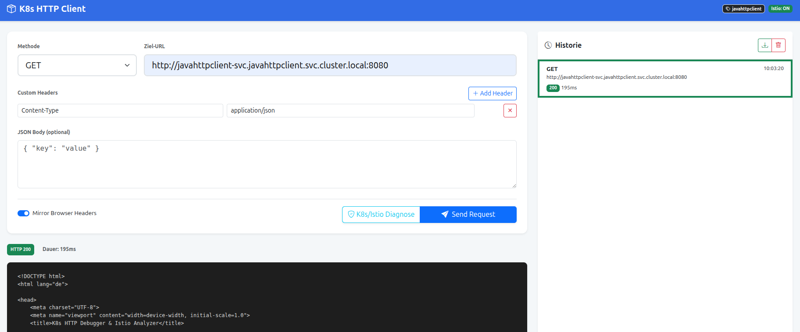
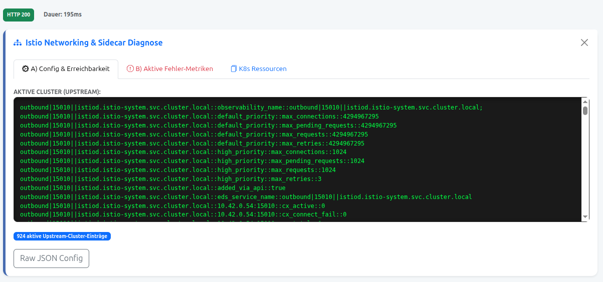
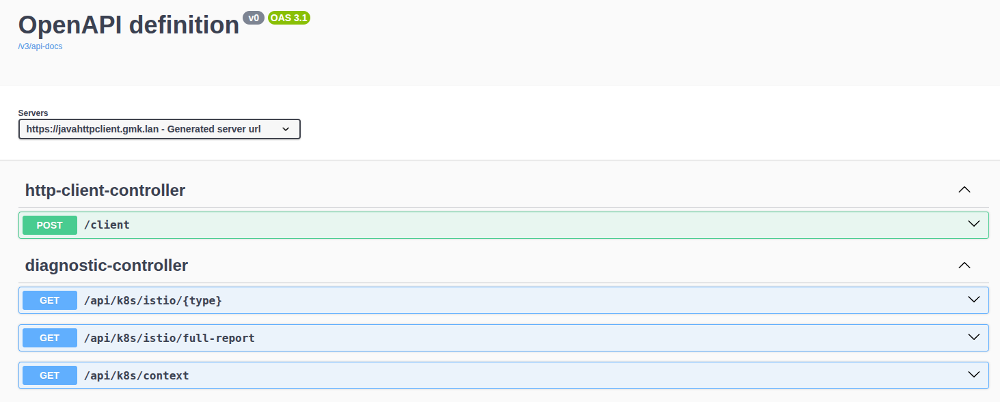

# JavaHttpClient

Spring based rest service to test http routes in kubernetes.
Showing http status, response, timing and istio envy settings.

## Web ui



## Istio tab



## Swagger



# Build

```bash
mvn package
```

# Docker build

```bash
docker build -t wlanboy/javahttpclient:latest . 
```

# Docker build with jlink and without

```bash
docker build -f Dockerfile25Jlink -t wlanboy/javahttpclient:jlink .
docker build -f Dockerfile25 -t wlanboy/javahttpclient:jre .

docker images --format "table {{.Repository}}\t{{.Tag}}\t{{.Size}}" | grep "javahttpclient"
wlanboy/javahttpclient   jre       510MB
wlanboy/javahttpclient   jlink     223MB
```

# Run container

```bash
docker run --rm --name httpclient --publish 8080:8080 wlanboy/javahttpclient:latest

docker run --rm --name httpclient --publish 8080:8080 wlanboy/javahttpclient:jlink
```

# Docker hub
* https://hub.docker.com/r/wlanboy/javahttpclient

# Test java http client

```bash
curl -L -X POST 'http://127.0.0.1:8080/client' -H 'Content-Type: application/json' \
-d '{"url" : "https://github.com", "copyHeaders": "false"}'
```

# local dev

```bash
curl -fsSL https://raw.githubusercontent.com/metalbear-co/mirrord/main/scripts/install.sh | bash

POD=$(kubectl get pod -n javahttpclient -l app=javahttpclient -o jsonpath='{.items[0].metadata.name}')

mirrord exec -n javahttpclient --target deployment/javahttpclient -- mvn spring-boot:run 

mirrord exec -n javahttpclient --target pod/$POD -- java -jar target/javahttpclient-0.0.1-SNAPSHOT.jar

mirrord exec -n javahttpclient --target deployment/javahttpclient -- java -jar target/javahttpclient-0.0.1-SNAPSHOT.jar
```

# swagger uri

* http://localhost:8080/swagger-ui/index.html#/http-client-controller/postMapping

# curl calls for mirrorservice

* see: https://github.com/wlanboy/MirrorService

```bash
curl -X 'POST' \
  'http://localhost:8080/client' \
  -H 'accept: */*' \
  -H 'Content-Type: application/json' \
  -d '{
  "url": "http://gmk:8003/resolve/google.com",
  "method": "GET",
  "body": "",
  "copyHeaders": false
}'

curl -X 'POST' \
  'http://localhost:8080/client' \
  -H 'accept: */*' \
  -H 'Content-Type: application/json' \
  -d '{
  "url": "http://gmk:8003/mirror?request=HalloWelt&statuscode=200&wait=4",
  "method": "GET",
  "body": "",
  "copyHeaders": true
}'
```

